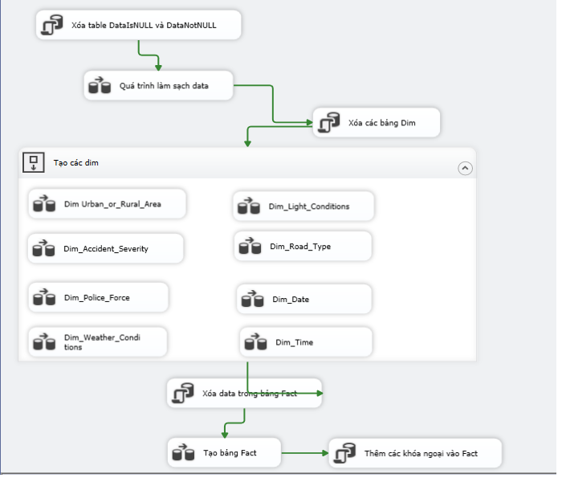

# Using SQL Server Integration Services to ETL data from CSV files to Data Warehouse in SQL Server.

- Data: Accidents in UK from 2005 to 2015. Data is csv file.
    <a href="https://www.kaggle.com/datasets/silicon99/dft-accident-data?resource=download">Lnk to data</a>
- Image of flow ETL
    
- Link access to SSAS và SSRS + Power BI for for analysis and reporting purposes
    + <a href="https://github.com/vanac17122001/Accident_In_UK_SSAS">Link to SSAS project</a>
    + <a href="https://github.com/vanac17122001/Accidents_In_UK_SSRS_PowerBI">Link to SSAS project</a>
- Reference: https://www.youtube.com/watch?v=Ncz72eZrpHQ&t=1s&ab_channel=SoanTr%E1%BA%A7n , Quá trình SSIS - Môn kho dữ liệu và OLAP., Soan Trần